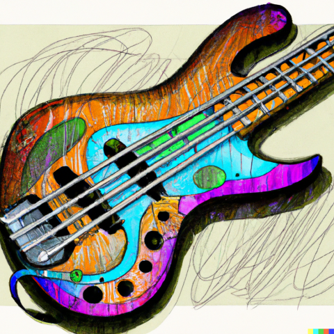

# Gigex 🎸



A scraper for gigs.

Currently supporting getting jazz concerts from Songkick in Berlin.


# Usage

```elixir
iex> Gigex.get() |> Enum.take(5)
[
   %{
     name: "Led Zeppelin",
     date: "2022-12-10",
     dotw: "Thursday",
     location: "SO36",
     datasource: "lido"
   },
   %{
     name: "The Cure",
     date: "2022-12-09",
     dotw: "Friday",
     location: "Metropol",
     datasource: "songkick"
   },
   %{
     name: "The all seeing I",
     date: "2022-12-12",
     dotw: "Sunday",
     location: "Earthsea",
     datasource: "lido"
   },
   %{
     name: "Kokoroko",
     date: "2022-12-14",
     dotw: "Wednesday",
     location: "Tangeri",
     datasource: "songkick"
   },
   %{
     name: "Dave Brubeck",
     date: "2022-12-15",
     dotw: "Saturday",
     location: "Blue Note"
     datasource: "songkick"
   }
]
```
